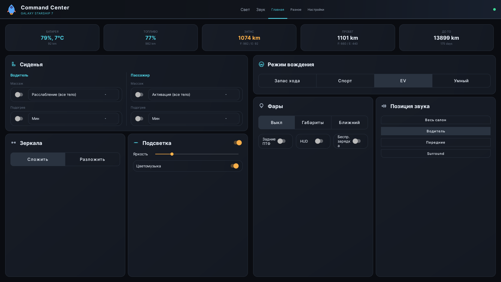
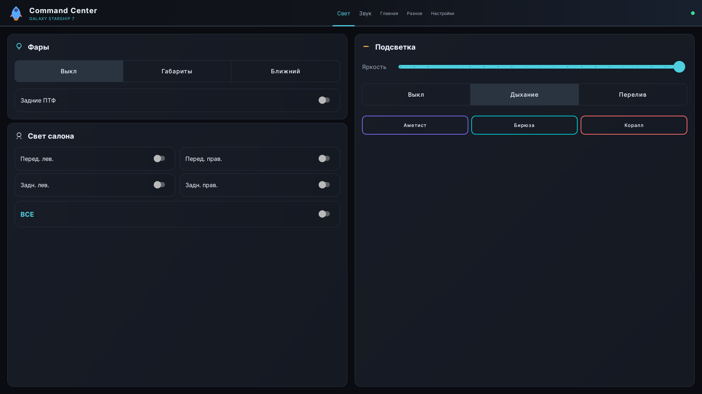
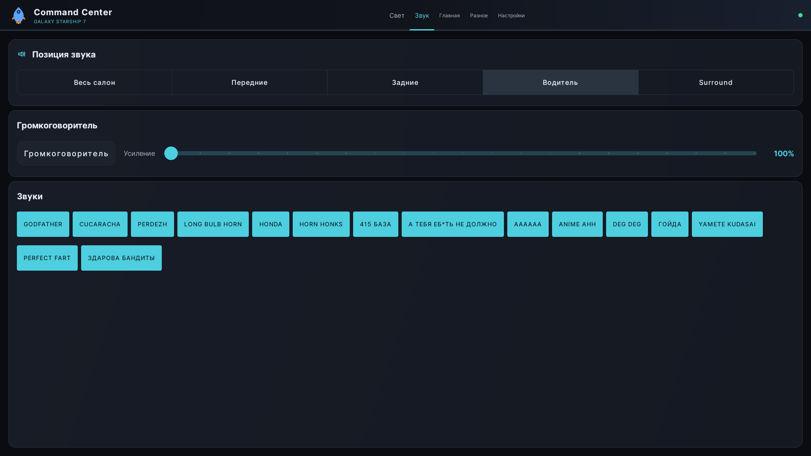
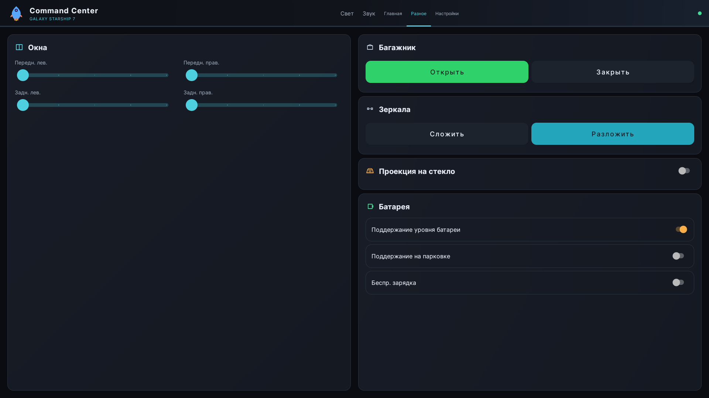
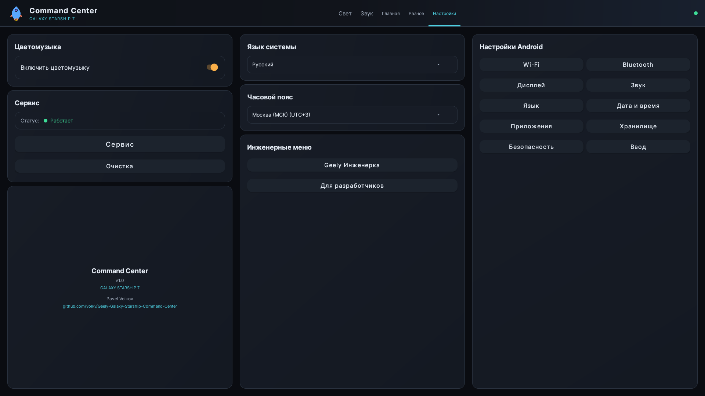

> **🚀 Этот open source проект стал основой для [GeelyLab](https://geelylab.ru/) — комплексного решения для владельцев Geely Galaxy**

# GGSCC - Geely Galaxy Starship Command Center

Android-приложение для прямого управления системами автомобиля Geely через Android Car API. Изначально разработано как личный проект для изучения возможностей программного взаимодействия с автомобильными системами на головных устройствах с FlymeAuto.

**Автор:** Pavel Volkov



<table>
  <tr>
    <td></td>
    <td></td>
  </tr>
  <tr>
    <td></td>
    <td></td>
  </tr>
</table>

## О проекте

Это приложение создано из любопытства и желания понять, как современные подключённые автомобили предоставляют доступ к своим внутренним системам через программные интерфейсы. Оно служит **proof of concept** и **технической демонстрацией** того, что возможно при наличии доступа к Android Car API на совместимых автомобилях.

Код публикуется открыто в духе обмена знаниями и для помощи тем, кто исследует аналогичные области. Это **не** готовый продукт и не замена штатному ПО автомобиля.

**Используйте полностью на свой страх и риск.** Автор не несёт ответственности за любые последствия использования этого ПО.

## Функционал

### 🚗 Режимы движения
- **Range Extended** — гибридный режим для максимального запаса хода
- **Sport** — спортивный режим
- **Electric** — чистый электрический режим
- **Intelligent** — автоматический выбор режима системой

### 💺 Функции сидений
- **Подогрев** — 4 уровня (Выкл/Мин/Сред/Макс) для водителя и пассажира
- **Вентиляция** — 4 уровня для водителя и пассажира
- **Массаж** — вкл/выкл с 8 типами массажа для обоих сидений

### 🪟 Окна и зеркала
- **Окна** — индивидуальные слайдеры (0-100%) для всех 4 окон
- **Люк** — позиционирование в процентах
- **Зеркала** — складывание/раскладывание боковых зеркал

### 🚪 Багажник
- Дистанционное открытие/закрытие багажника

### 💡 Внешнее освещение
- **Режимы фар** — Выкл / Габариты / Ближний свет
- **Задние ПТФ** — переключатель

### ✨ Внутреннее освещение
- **Плафоны** — индивидуальное управление 4 зонами + все сразу
- **Эмбиентная подсветка**:
  - Регулировка яркости (0-20 уровней)
  - Режимы: Выкл / Дыхание / Градиент
  - Пресеты дыхания: Аметист, Бирюза, Коралл
  - Пресеты градиента: Закат, Северное сияние, Розовый рассвет
  - Режим Color Music — подсветка под музыку

### 🔊 Аудиосистема
- **Позиционирование звука** — Весь салон / Передние / Задние / Водитель
- **Surround Sound** — переключатель объёмного звука
- **Внешний громкоговоритель** — вкл/выкл и регулировка громкости
- **Звуковые пресеты** — воспроизведение предустановленных аудиофайлов

### 🔋 Батарея и зарядка
- **Режим батареи** — Обычный / Удержание заряда
- **Зарядка на парковке** — вкл/выкл зарядки на стоянке
- **Статистика зарядки в реальном времени**: Напряжение, Ток, Мощность (кВт), Оставшееся время

### 📊 Информация об автомобиле (Dashboard)
- **Батарея**: Процент, Температура, Напряжение
- **Топливо**: Процент, Запас хода
- **Запас хода EV**: Километры
- **Общий запас хода**: Топливо + EV
- **Одометр**: Общий пробег с разбивкой (топливо/EV)
- **ТО**: Пробег и дни до следующего обслуживания
- **Энергопотребление**: Движение, Климат, Батарея, Прочее

### ⚙️ Системные настройки
- **Язык системы** — Русский, English, 中文
- **Часовой пояс** — Москва, Екатеринбург, Новосибирск, Владивосток, Пекин
- **Быстрый доступ к настройкам Android**:
  - Инженерное меню Geely
  - Для разработчиков
  - Wi-Fi, Bluetooth
  - Дисплей, Звук
  - Язык, Дата и время
  - Приложения, Хранилище, Безопасность
  - Методы ввода
- **Сервис MediaBridge** — индикатор статуса и кнопка перезапуска
- **Режим очистки экрана** — временно отключает сенсор

## Поддерживаемый автомобиль

**Geely Galaxy Starship 7** (P145) с **FlymeAuto** (Android Automotive OS на базе Meizu/Ecarx).

## Требования

- Android Automotive OS с FlymeAuto
- ROOT-доступ (рекомендуется) или возможность установки как системное привилегированное приложение
- Android SDK API 28+ (Android 9.0+)
- ADB для установки

## Сборка

```bash
# Клонировать репозиторий
git clone https://github.com/volkv/Geely-Galaxy-Starship-Command-Center.git
cd Geely-Galaxy-Starship-Command-Center

# Скачать AOSP ключи для подписи
./setup-keys.sh

# Собрать APK
./gradlew assemblePrivilegedRelease
```

APK будет создан в:
```
app/build/outputs/apk/privileged/release/app-privileged-release.apk
```

## Установка

### Подготовка

1. Включить отладку по USB на головном устройстве
2. Подключиться через ADB (USB или по сети)
3. Получить ROOT-доступ к устройству

### Быстрая установка (ROOT)

```bash
# Использовать скрипт развёртывания
./deploy.sh --fresh
```

### Ручная установка

```bash
# 1. Собрать APK
./gradlew assemblePrivilegedRelease

# 2. Установить как привилегированное системное приложение
adb root && adb remount
adb shell mkdir -p /system/priv-app/com.ggscc.app
adb push app/build/outputs/apk/privileged/release/app-privileged-release.apk \
    /system/priv-app/com.ggscc.app/com.ggscc.app.apk
adb push privapp-permissions-com.ggscc.app.xml /system/etc/permissions/
adb shell chmod 644 /system/priv-app/com.ggscc.app/com.ggscc.app.apk
adb shell chmod 644 /system/etc/permissions/privapp-permissions-com.ggscc.app.xml

# 3. Перезагрузить
adb reboot
```

Подробные инструкции и решение проблем — в [INSTALL.md](INSTALL.md).

## Makefile

```bash
make setup         # Скачать AOSP ключи
make build         # Собрать APK
make deploy        # Быстрое обновление
make deploy-fresh  # Полная переустановка с перезагрузкой
make logs          # Показать логи приложения
make clean         # Очистить артефакты сборки
```

## Структура проекта

```
app/src/main/java/com/ggscc/app/
├── MainActivity.kt                 # Главная Activity
├── ControllerRegistry.kt           # Реестр всех контроллеров
├── MediaBridgeService.kt           # Фоновый сервис для медиа-интеграции
├── car/
│   ├── CarModel.kt                 # Константы модели (P145)
│   ├── VehiclePropertyHelper.kt    # Обёртка Car API
│   ├── CarAudioPlayer.kt           # Воспроизведение через аудиосистему авто
│   ├── LoudspeakerController.kt    # Управление внешним громкоговорителем
│   └── WheelButtonHandler.kt       # Обработка кнопок на руле
├── controllers/
│   ├── AmbientLightController.kt   # Эмбиент (дыхание, градиент, color music)
│   ├── AudioController.kt          # Позиционирование звука и surround
│   ├── BatteryController.kt        # Режим батареи и зарядка
│   ├── DriveModeController.kt      # Выбор режима движения
│   ├── ExteriorLightController.kt  # Фары и габариты
│   ├── FogLightController.kt       # Задние ПТФ
│   ├── LightController.kt          # Плафоны салона
│   ├── MirrorController.kt         # Складывание зеркал
│   ├── SeatHeatingController.kt    # Подогрев сидений
│   ├── SeatLevelController.kt      # Базовый класс уровней сидений
│   ├── SeatMassageController.kt    # Тип и мощность массажа
│   ├── SeatVentilationController.kt# Вентиляция сидений
│   ├── SystemSettingsController.kt # Язык, часовой пояс, настройки
│   ├── TrunkController.kt          # Открытие/закрытие багажника
│   ├── VehicleInfoController.kt    # Данные автомобиля в реальном времени
│   └── WindowController.kt         # Позиционирование окон
├── tools/
│   └── PropertyConstants.kt        # Vendor-specific property IDs
└── ui/
    └── fragments/
        ├── HomeFragment.kt         # Dashboard со статистикой
        ├── AudioFragment.kt        # Настройки аудио
        ├── LightsFragment.kt       # Внешний/внутренний/эмбиент свет
        ├── MiscFragment.kt         # Окна, багажник, зеркала, батарея
        └── SettingsFragment.kt     # Системные настройки
```

## Технические заметки

- Приложение работает как **привилегированное системное приложение** в `/system/priv-app/`
- Property ID **специфичны для вендора** и могут отличаться между моделями и версиями прошивки
- Area ID следуют стандартному паттерну: 1=водитель, 4=пассажир, углы окон: 16/64/256/1024
- Некоторые свойства требуют специальных разрешений через XML-файл whitelist

## Отказ от ответственности

Это ПО предоставляется **«как есть»**, без каких-либо гарантий, явных или подразумеваемых. Автор не даёт никаких гарантий относительно безопасности, надёжности или пригодности этого ПО для каких-либо целей.

**Используя это ПО, вы признаёте, что:**

- Вы несёте полную ответственность за любые модификации систем вашего автомобиля
- Неправильное использование может привести к аннулированию гарантии, повреждению или созданию угрозы безопасности
- Этот проект не связан с Geely, Meizu, Ecarx или любой другой компанией и не одобрен ими
- Системы автомобиля сложны и взаимосвязаны; изменения могут иметь непредвиденные последствия

**Не используйте это ПО во время движения.** Всегда управляйте автомобилем безопасно и в соответствии с местными законами.

## Лицензия

MIT License — см. [LICENSE](LICENSE).

## Благодарности

Этот проект существует благодаря открытой природе Android Automotive OS и любопытству разработчиков, исследующих границы возможного в современных подключённых автомобилях.
